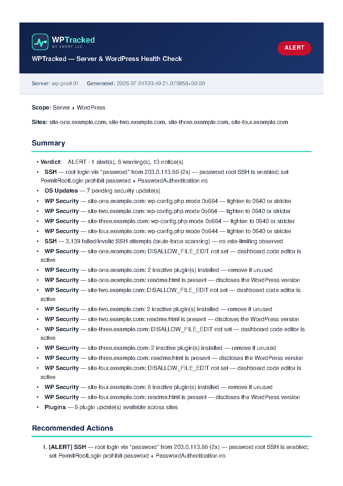
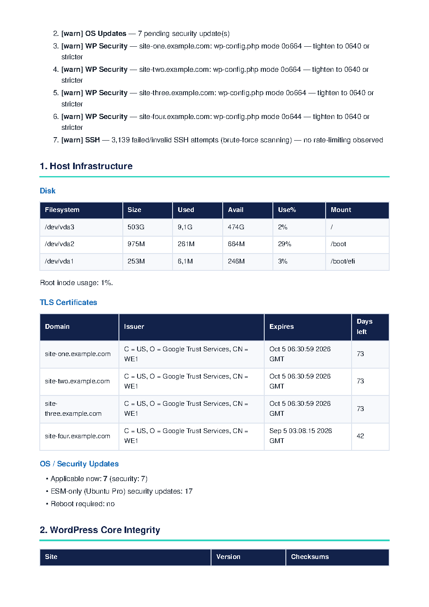
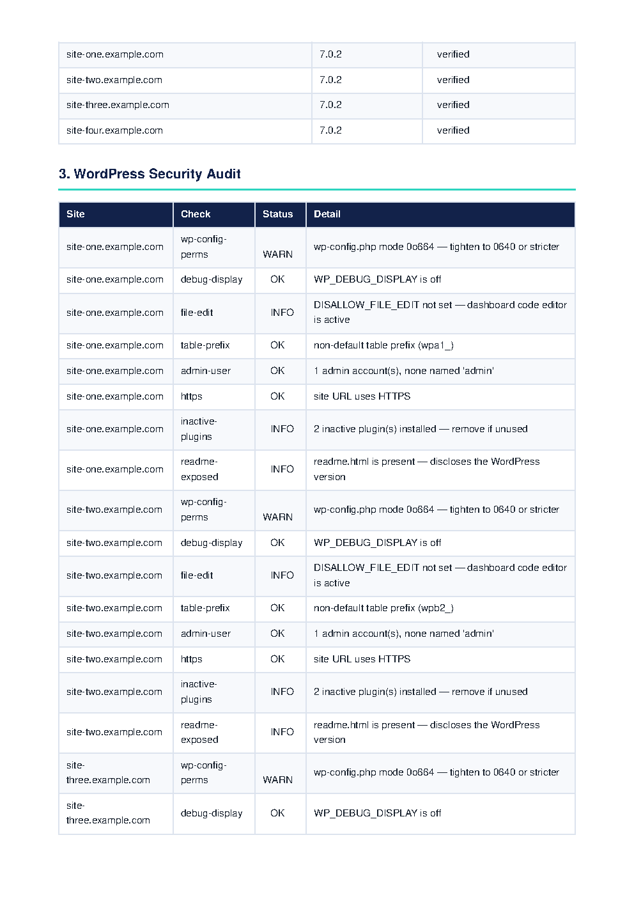

<div align="center">
  
  <h1>WPTracked</h1>
  <p><strong><em>Know your WordPress fleet is healthy.</em></strong></p>
  <p>
    The quiet marshal keeping the WordPress frontier safe — an automated,
    <strong>strictly read-only</strong> server &amp; WordPress health auditor that
    rides out on <em>your</em> own infrastructure via a Devin outpost and wires
    home a branded report.
  </p>
  <p>
    
    
    
    
    
  </p>
  <p>
    <b><a href="https://wptracked.com">Visit wptracked.com</a></b> ·
    <b><a href="https://github.com/varry-llc/WPTracked">View on GitHub</a></b> ·
    <b><a href="reports/sample-wptracked-report.md">See a sample report</a></b>
  </p>
</div>

---

> Websites rarely fail loudly. They degrade **quietly** until the damage is already
> done — an unpatched plugin becomes a backdoor, a config left world-readable
> becomes an open vault, a cert lapses, the disk fills with intrusion noise.
> WPTracked is the scout that reads the signs before the raid.

**WPTracked** rides a routine, **strictly read-only** health & security sweep of a
VPS and every WordPress site it hosts, calls the verdict `[HEALTHY]` or
`[ALERT]`, and wires home a branded report (HTML body + PDF attachment) through
the mail carrier of your choice. It runs **on the server** — from a scheduled
**[Devin outpost](docs/OUTPOST.md)** session or a native `cron`/systemd timer.

> ### 🤠 Strictly read-only
> WPTracked is an **observer**. It never modifies files, never updates databases,
> and never alters configs — fail-closed, no secrets logged, locked & idempotent
> runs. Automated remediation (approved updates *with* reports) is a documented
> [future capability](#wanted--the-roadmap), holstered for now.

## Two scopes — pick your territory

Selected with `WPT_MODE`:

| `WPT_MODE` | What runs |
|---|---|
| `server` | Host infrastructure + logs only — **no WordPress** (great for any VPS) |
| `server+wp` *(default)* | Everything below |

## The marshal's rounds — what it checks

A comprehensive sweep from the bedrock OS to the weather-vane on the saloon roof:

| Area | Checks | Scope |
|---|---|---|
| **1 · Host & infrastructure** | Disk usage (`df`) + inode pressure, TLS certificate expiry per domain, pending OS/security updates (apt), reboot-required flag | both |
| **2 · Logs & perimeter defense** | Web-server (OpenLiteSpeed/Nginx/Apache) error logs, access-log status/threat summary (5xx, `wp-login`, `xmlrpc`, user-enum, `.env`/`.git` probes), SSH `auth.log` brute-force + successful-login analysis | both |
| **3 · WordPress core & config** | `wp core verify-checksums` on every install (tamper detection) + core version | wp |
| **4 · Plugins & themes** | Per-site inventory + available updates | wp |
| **5 · Vulnerability scouting** | Known-vulnerability scan vs [wpvulnerability.net](https://www.wpvulnerability.net) (CVE + Patchstack), each CVE cross-referenced against the **CISA KEV** catalog, abandoned/withdrawn plugin flags | wp |
| **6 · Security best-practices audit** | `wp-config.php` permissions, `WP_DEBUG_DISPLAY`, `DISALLOW_FILE_EDIT`, default table prefix, predictable `admin` account, HTTPS site URL, dormant inactive plugins, `readme.html` version disclosure | wp |

Every check is **toggleable** (all on by default) — see [Configuration](#configuration).

The verdict is `[ALERT]` if any critical condition is found (core tampering, a
matching vulnerability/KEV, disk ≥ 90%, cert expiring soon, 5xx errors,
world-writable `wp-config.php`, or password-based root SSH), otherwise
`[HEALTHY]`. A check that cannot be completed is reported as *skipped/incomplete*
— **never** silently treated as clean.

## The four-step posse — how it works

```
                                          ┌── reports/<name>.md    (plain / e-mail text)
collect.py ──▶ vuln_scan.py ──▶ render_report.py ──▶ reports/<name>.html  (branded e-mail body)
   │               │                 │            └── reports/<name>.pdf   (branded attachment)
 data.json      vuln.json         verdict + manifest
                                          │
                                          └──▶ send_report.py ──▶ MAIL_TRANSPORT
                                                                  (emailit│smtp│sendgrid│mailgun│resend)
```

Four riders, one job — **Collect → Scan → Render → Send**. Each stage writes JSON
the next stage consumes, so you can run/inspect any rider alone.
`bin/healthcheck.sh` wires them together under a `flock` lock.

| Script | Rider | Role |
|---|---|---|
| [`scripts/collect.py`](scripts/collect.py) | **Collect** | Gather all raw data into `out/data.json` (read-only), honouring `WPT_MODE` + `CHECK_*` |
| [`scripts/vuln_scan.py`](scripts/vuln_scan.py) | **Scan** | Match inventory vs wpvulnerability.net + CISA KEV → `out/vuln.json` |
| [`scripts/render_report.py`](scripts/render_report.py) | **Render** | Apply verdict rules; render Markdown + branded HTML + PDF |
| [`scripts/send_report.py`](scripts/send_report.py) | **Send** | Deliver via the configured provider-agnostic transport |
| [`bin/healthcheck.sh`](bin/healthcheck.sh) | *Marshal* | Orchestrator (`collect → scan → render → send`) with locking |
| [`bin/install-cron.sh`](bin/install-cron.sh) | *Timekeeper* | Install/remove the schedule (hourly/daily/weekly/monthly) |

## Quickstart

### Step 0 — get onto the server via a Devin outpost

WPTracked runs **on the target server**. The native way to get there is a Devin
outpost (Devin's agent loop stays in the cloud; commands run on your box). On the
**server**:

```bash
# 0a. Install the Devin CLI
curl -fsSL https://cli.devin.ai/install.sh | bash

# 0b. Create an outpost in Devin Cloud:
#     Settings → Environment → Outposts → "Create Outpost"  (name it, platform = Linux)

# 0c. Start a worker that serves that outpost (outbound-only HTTPS; runs as your user)
devin worker start --outpost=<outpost_name>
```

Then start a Devin session **on that outpost** — it now appears as a machine
option in Devin Cloud, and the worker on your server runs the session locally.
Full details (prerequisites, API-token scopes, keeping the worker alive, the
privileged `auth.log` pattern) are in **[docs/OUTPOST.md](docs/OUTPOST.md)**;
upstream: https://docs.devin.ai/cloud/outposts/quickstart

*(Prefer to run it yourself over plain SSH? Skip Step 0 — everything below works
on any shell on the server.)*

### Step 1 — install & run

```bash
git clone https://github.com/varry-llc/WPTracked.git
cd WPTracked

# 1. Configure
cp config/wptracked.env.example config/wptracked.env
chmod 600 config/wptracked.env
$EDITOR config/wptracked.env      # set MAIL_TRANSPORT + its creds, MAIL_TO, SSH_ALLOWLIST, …

# 2. Install the one Python dependency (PDF rendering)
python3 -m pip install -r requirements.txt      # or: sudo apt install python3-weasyprint

# 3. Run it (as root so auth.log is included)
sudo bin/healthcheck.sh --no-send        # first run: generate only, review the report
sudo bin/healthcheck.sh --dry-run        # validate mail config, build payload, do not send
sudo bin/healthcheck.sh --send           # generate + deliver
```

Running on a server with no WordPress? Set `WPT_MODE=server` and go.

## Requirements

- **Python 3.9+** (standard library only for collection/sending; WeasyPrint for PDF).
- **[WP-CLI](https://wp-cli.org/)** (`wp`) on `PATH` — only for `server+wp` mode.
- **WeasyPrint** for the PDF attachment (`requirements.txt`). System libraries:
  `libpango-1.0-0 libpangocairo-1.0-0 libcairo2 libgdk-pixbuf-2.0-0`.
  *Without it the run still produces the Markdown + HTML report; only the PDF is skipped.*
- **`openssl`** (TLS expiry) — present on virtually every server.
- **Root** (or a user in the `adm` group) to read `/var/log/auth.log`.
- A mail transport: an **[EmailIt](https://emailit.com/docs)** key, any **SMTP**
  server, or **SendGrid / Mailgun / Resend** — see below.

## Configuration

All settings live in `config/wptracked.env` (git-ignored). Every value can also
be a real environment variable, which always wins. See
[`config/wptracked.env.example`](config/wptracked.env.example) for the full,
commented list. The essentials:

### Scope & checks
| Variable | Purpose |
|---|---|
| `WPT_MODE` | `server` or `server+wp` (default) |
| `WWW_ROOT` | Primary web root (default `/var/www`); sites are discovered **recursively** (nested docroots like `<site>/htdocs` included) |
| `WWW_ROOTS` | Optional comma-separated list of **additional** roots when sites span several locations (globs like `/home/*/htdocs` expanded) |
| `CHECK_DISK`, `CHECK_SSL`, `CHECK_UPDATES`, `CHECK_WEB_LOGS`, `CHECK_AUTH_LOG` | Host/log toggles (all `1`) |
| `CHECK_WP_CORE`, `CHECK_WP_UPDATES`, `CHECK_WP_VULN`, `CHECK_WP_SECURITY` | WordPress toggles (all `1`) |

Set any toggle to `0` to disable it; disabled checks are omitted from both the
data and the report (they are **not** counted as passing).

### Mail (provider-agnostic)
| Variable | Purpose |
|---|---|
| `MAIL_TRANSPORT` | `emailit` \| `smtp` \| `sendgrid` \| `mailgun` \| `resend` \| `none` |
| `MAIL_FROM` / `MAIL_TO` / `MAIL_REPLY_TO` | Addressing (all transports) |
| `EMAILIT_API_KEY` | EmailIt Bearer token |
| `SMTP_HOST` / `SMTP_PORT` / `SMTP_USER` / `SMTP_PASSWORD` / `SMTP_SECURITY` | SMTP (`starttls`\|`ssl`\|`none`) |
| `SENDGRID_API_KEY` / `RESEND_API_KEY` | SendGrid / Resend keys |
| `MAILGUN_API_KEY` / `MAILGUN_DOMAIN` / `MAILGUN_BASE` | Mailgun |

Credentials are read from the environment only, never printed or placed on a
command line. Mail config is validated **before** any network call; a missing
key fails loudly (non-zero exit) — delivery is never silently skipped or falsely
reported as sent. HTTP transports use bounded retries, timeouts, and an
idempotency key so a retried run does not duplicate the e-mail.

### Scheduling & branding
| Variable | Purpose |
|---|---|
| `SCHEDULE_FREQUENCY` / `SCHEDULE_TIME` / `SCHEDULE_DOW` / `SCHEDULE_DOM` | Used by `bin/install-cron.sh` |
| `SSH_ALLOWLIST` | IPs whose key-based logins are expected (control plane, worker) |
| `DISK_*` / `SSL_*` | Warning/alert thresholds |
| `BRAND_COMPANY` / `BRAND_PROJECT` / `BRAND_LOGO` | Branding (re-brand per client without code changes) |
| `WPT_REPO_URL` / `WPT_SITE_URL` | Links shown in the report footer |

## The bounty — a report worth riding for

Raw data is forged into a branded report — a rich HTML e-mail body plus a
portable PDF, grouped logically (verdict → recommended actions → host → core →
WP security → vulnerabilities → logs → SSH) and dispatched via your mail carrier
of choice.

This is a **real `[ALERT]` run** (4 sites) with every identifying value replaced
by documentation placeholders — hostname `wp-prod-01`, `*.example.com`, and
[RFC 5737](https://datatracker.ietf.org/doc/html/rfc5737) IPs
(`198.51.100.x`, `203.0.113.x`, `192.0.2.x`). The findings, versions, counts and
verdict are otherwise as produced by the tool:

<div align="center">
  
  <br><br>
  
  <br><br>
  
</div>

The full sample is committed as
[`reports/sample-wptracked-report.md`](reports/sample-wptracked-report.md) and
the branded PDF at
[`reports/sample-wptracked-report.pdf`](reports/sample-wptracked-report.pdf).

## Documentation

- **[docs/OUTPOST.md](docs/OUTPOST.md)** — end-to-end setup on the server through a Devin outpost (native workflow, dependencies, permissions, first run).
- **[docs/SCHEDULING.md](docs/SCHEDULING.md)** — recurring runs: `cron`, systemd timer, or a Devin Automation; frequency, locking, missed schedules.
- **[docs/REPORT.md](docs/REPORT.md)** — report sections, verdict rules, the WordPress security audit, and coverage caveats.
- **[docs/OUTPOST.md#troubleshooting](docs/OUTPOST.md#troubleshooting)** — troubleshooting + lessons learned (a site missing from the report, `sudo`/run-user mismatches, `auth.log` access).

## Testing

```bash
python3 -m unittest discover -s tests      # hermetic: no network, no server, no real e-mail
```

## Security & safety

- **Read-only.** Nothing updates WordPress, changes server/SSH/firewall config,
  or installs packages. It only *reports*.
- **No secrets in git.** `config/wptracked.env`, everything in `out/`, and
  generated `reports/*` are git-ignored. Keep the env file `chmod 600`.
- **Fail-closed.** An incomplete vulnerability lookup or an unreadable log is
  reported as *incomplete*, never as a clean bill of health.
- Dynamic values are passed as argument arrays (no shell interpolation); commands
  and network calls are time-bounded; a `flock` prevents overlapping runs.

## Wanted — the roadmap

Today WPTracked is purely a **scout**. Next up (not yet available — coming soon
to the frontier): an **opt-in approved automated-updates mode** that applies
known-safe security patches — with pre-update backups, staged rollout,
post-update health verification, rollback, and an e-mailed update summary. It is
**not** implemented today; WPTracked remains strictly read-only.

---

<div align="center">
  <sub><strong>WPTracked</strong> — strictly read-only server &amp; WordPress health auditing<br>
  A product of <a href="https://wptracked.com">Varry LLC</a> · © 2026 Varry LLC. All rights reserved.</sub>
</div>
